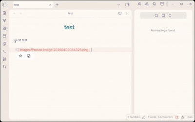

# privacy-mosaic

[简体中文说明](./README.zh-CN.md)

Privacy mosaic is an [Obsidian](https://obsidian.md) plugin for hiding sensitive text and images behind a blur or mosaic-style mask. It uses `++content++` syntax and supports both hover reveal and double-click reveal.



## Features

- Privacy-focused masking for text and image content
- Simple `++content++` syntax for inline text and image embeds
- Works in both reading mode and live preview
- Supports hover reveal or double-click reveal
- Adjustable blur strength and transition duration
- Commands for wrapping a selection and revealing all masked content

## Usage

### Basic syntax

```markdown
This is normal text and ++this is masked text++.

Here is a masked image: ++![[photo.png]]++

Here is a masked external image: ++![[photo.png]](https://photo.png)++

Multiple items: ++secret A++ and ++secret B++
```

### Commands

| Command | Description |
| --- | --- |
| `Toggle mosaic on selection` | Wrap or unwrap the current selection with `++...++` |
| `Reveal/hide all mosaic` | Show or hide all masked content in the current view |

You can assign hotkeys in `Settings -> Hotkeys` by searching for `Privacy Mosaic`.

### Settings

| Setting | Default | Description |
| --- | --- | --- |
| Enable in editing mode | On | Apply masking in live preview |
| Reveal mode | Hover | Reveal on hover or by double-click |
| Blur strength | 8px | Blur intensity from `1` to `20` |
| Transition duration | 200ms | Animation duration from `0` to `500` ms |

## License

[MIT](./LICENSE)
